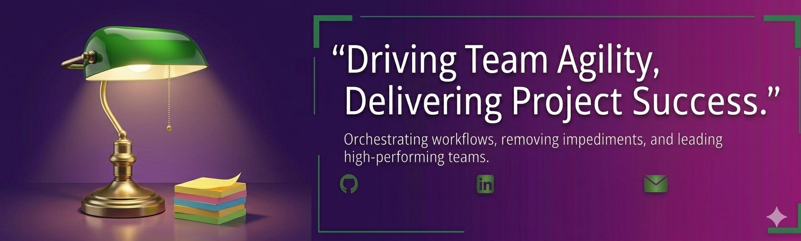
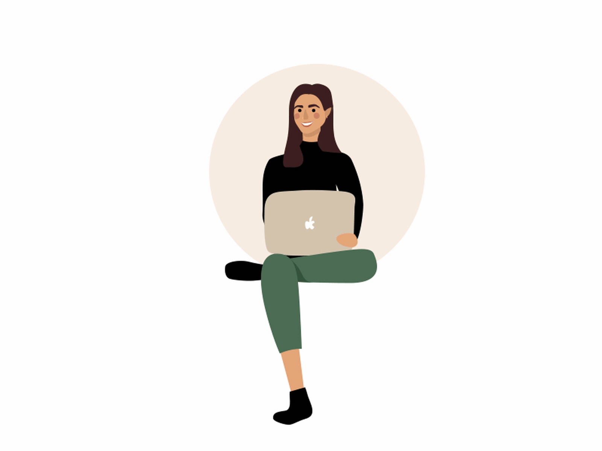

<h1 align="center">Hello I'm Divya</h1>

<!--
**0119divya/0119divya** is a ✨ _special_ ✨ repository because its `README.md` (this file) appears on your GitHub profile.
Here are some ideas to get you started: -->

  
  

  

## 👨🏻‍💻 About Me:

**- 🙋‍♂️ All about me is at **[My Upcoming Website](https://xyz/)**

- 🔭 I’m currently working on `Something Intresting`.

- 🌱 I’m currently preparing for `PMP certification`

- 👯 I’m looking to collaborate for `Agile based Projects and Coaching`

- 🤔 I’m looking for `A new opportunity to work at a challanging environment`

- 👨‍💻 Life Hack: Keep Learning :fire: and Keep Sharing :tada:

- ⚡ Fun fact: I spend most of my time creating art and learning new facts

## 🛠️ MY CORE COMPETENCIES:

Sprint Planning, Daily Standups, Retrospectives, Backlog Grooming, Retrospectives, Velocity Tracking, Release Planning, Program Governance, Cross-Team Collaboration, Agile Coaching, Delivery Tracking, Jira & Confluence

## ❤️ Let's get connected:

</a> 

